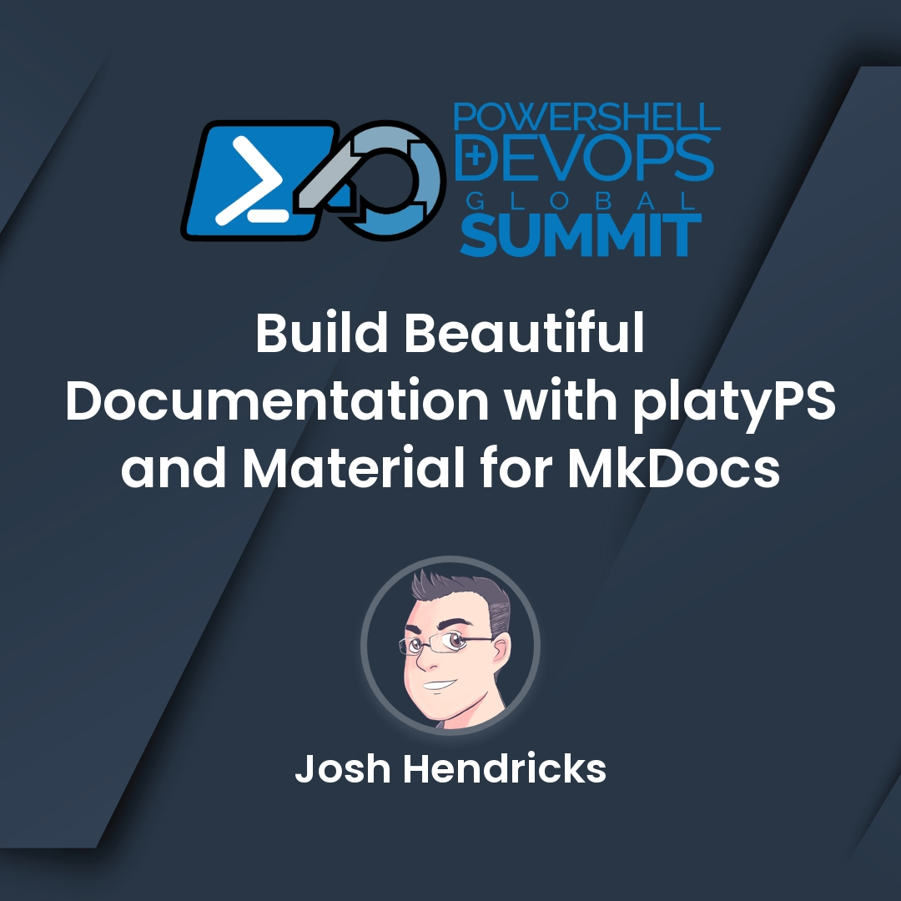

# Welcome

It has never been easier to build and publish professional documentation that is as __functional__ as it is __beautiful__.
Open up your laptop and allow me to introduce you to my favorite tools for building visualy appealing, responsive,
searchable online documentation.

My name is Josh Hendricks, and I'm a Senior Principal Engineer at Milestone Systems where I work with a great team of
developers. I have a wide range of experience but PowerShell has been my absolute most favorite area of work ever since
I started using it in 2019 when I began building the [MilestonePSTools](https://www.milestonepstools.com) module.
