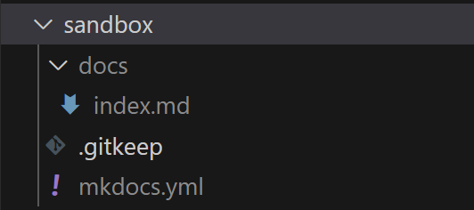

# Introduction

[MkDocs](https://www.mkdocs.org/) is a python-based static site generator that takes
source files in [markdown](https://www.markdownguide.org/) and builds beautiful,
responsive, searchable websites that can be hosted anywhere.

Follow along to familiarize yourself with the command-line interface and create
a simple website from scratch with a couple commands and a little markdown.

## Show Help

Run `mkdocs -h` to make sure mkdocs is installed and to see the CLI help:

``` text title="Command"
mkdocs -h
```

<div class="result" markdown>

``` text
Usage: mkdocs [OPTIONS] COMMAND [ARGS]...

  MkDocs - Project documentation with Markdown.

Options:
  -V, --version         Show the version and exit.
  -q, --quiet           Silence warnings
  -v, --verbose         Enable verbose output
  --color / --no-color  Force enable or disable color and wrapping for the output. Default is
                        auto-detect.
  -h, --help            Show this message and exit.

Commands:
  build      Build the MkDocs documentation
  get-deps   Show required PyPI packages inferred from plugins in mkdocs.yml
  gh-deploy  Deploy your documentation to GitHub Pages
  new        Create a new MkDocs project
  serve      Run the builtin development server
```

</div>

## Steps

### Step 1: Help

Run `mkdocs -h` to make sure mkdocs is installed and to see the CLI help. It should look like...

``` text
Usage: mkdocs [OPTIONS] COMMAND [ARGS]...

  MkDocs - Project documentation with Markdown.

Options:
  -V, --version         Show the version and exit.
  -q, --quiet           Silence warnings
  -v, --verbose         Enable verbose output
  --color / --no-color  Force enable or disable color and wrapping for the output. Default is
                        auto-detect.
  -h, --help            Show this message and exit.

Commands:
  build      Build the MkDocs documentation
  get-deps   Show required PyPI packages inferred from plugins in mkdocs.yml
  gh-deploy  Deploy your documentation to GitHub Pages
  new        Create a new MkDocs project
  serve      Run the builtin development server
```

### Step 2: New project

Create a new MkDocs project in the sandbox folder. The `.gitignore` file ensures
any new files in this folder are ignored by `git`.

``` title="Command"
mkdocs new ./sandbox/
```

Your `sandbox` directory now has an `mkdocs.yml` file, and a `docs/` folder with
a single `index.md` file.



``` yaml title="mkdocs.yml"
site_name: My Docs
```

``` yaml title="docs/index.md"
# Welcome to MkDocs

For full documentation visit [mkdocs.org](https://www.mkdocs.org).

## Commands

* `mkdocs new [dir-name]` - Create a new project.
* `mkdocs serve` - Start the live-reloading docs server.
* `mkdocs build` - Build the documentation site.
* `mkdocs -h` - Print help message and exit.

## Project layout

    mkdocs.yml    # The configuration file.
    docs/
        index.md  # The documentation homepage.
        ...       # Other markdown pages, images and other files.

```

### Step 3: Serve

Let's see what our new MkDocs project looks like as a website! Run the `mkdocs serve` command below, then open a browser
to [http://localhost:8000/](http://localhost:8000/) or whatever URL is provided to you if you're running this in a
GitHub codespace.

``` powershell title="Command"
mkdocs serve -f sandbox/mkdocs.yml # (1)!
```

1. mkdocs binds to 127.0.0.1:8000 by default. In some cases you may need to bind on all interfaces, or a different port.
Use `--dev-addr 0.0.0.0:8001` to listen for connections on TCP port 8001 on all interfaces for example.

``` title="Output"
PS /workspaces/docs-workshop> mkdocs serve -f ./sandbox/mkdocs.yml
INFO    -  Building documentation...
INFO    -  Cleaning site directory
INFO    -  Documentation built in 0.28 seconds
INFO    -  [19:58:02] Watching paths for changes: 'sandbox/docs', 'sandbox/mkdocs.yml'
INFO    -  [19:58:02] Serving on http://127.0.0.1:8000/
INFO    -  [19:58:25] Browser connected: http://localhost:8000/
INFO    -  [19:58:28] Browser connected: http://localhost:8000/
INFO    -  [20:06:41] Browser connected: http://localhost:8000/
```

### Step 4: Update content

### Step 5: Experiment

There are a bunch of themes for MkDocs. Check out this [catalog](https://github.com/mkdocs/catalog?tab=readme-ov-file#-theming)
of themes as well as a variety of extensions.

``` title="Command"
pip install --force-reinstall mkdocs mkdocs-terminal mkdocs-dracula-theme mkdocs-simple-blog
```

``` yaml title="mkdocs.yml"
theme:
  name: mkdocs # Options: mkdocs | readthedocs | material | terminal | dracula | simple-blog
```

### Reset

``` powershell
Remove-Item ./sandbox/docs/, ./sandbox/mkdocs.yml -Recurse
```
