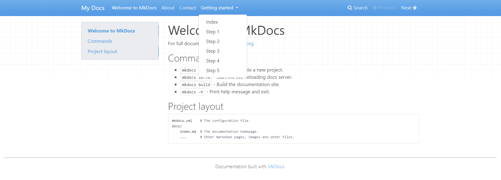

# Add content



With a new MkDocs project bootstrapped and being served with `mkdocs serve`, you
can now modify existing markdown files in your `./docs/` directory, or add new ones,
and the site served by the `mkdocs` command-line tool will update when the contents
of the `mkdocs.yml` file or `./docs/` directory are modified.

!!! example
    Copy and paste the PowerShell code below to generate a few pages. Make sure you are
    in the root of the repository, and the pages will be created in `./sandbox/docs/`
    automatically.

    ``` powershell title="Command"
    --8<-- "mkdocs/generate-pages.ps1"
    ```
