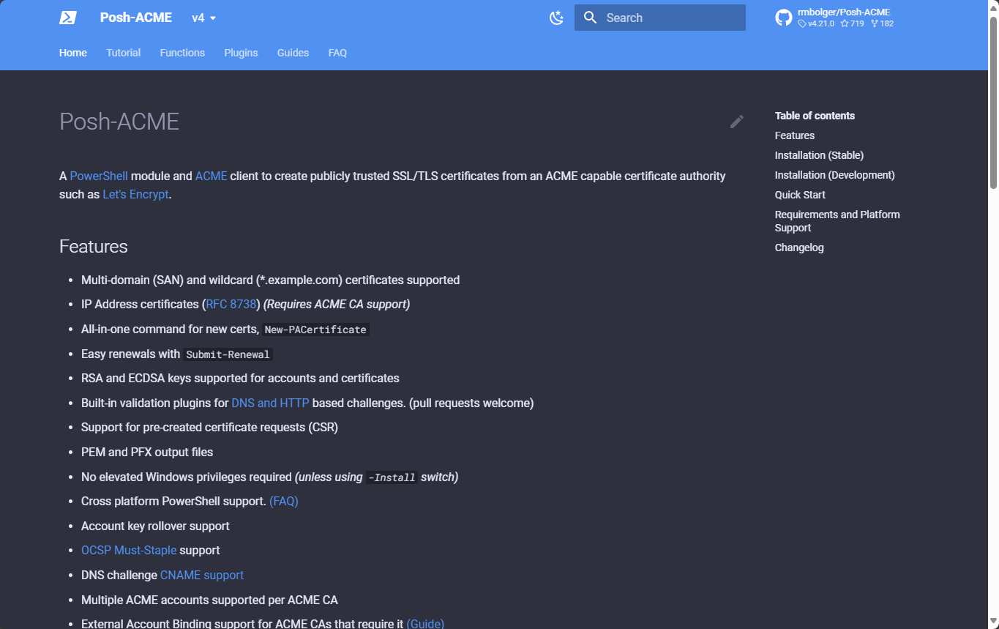
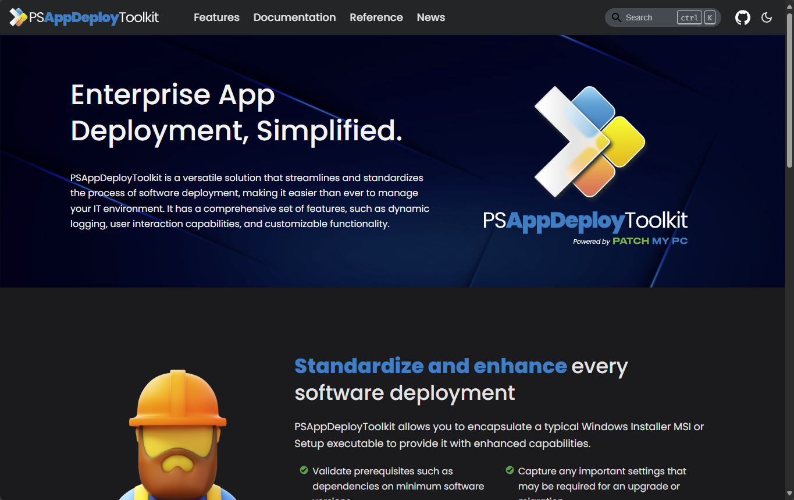
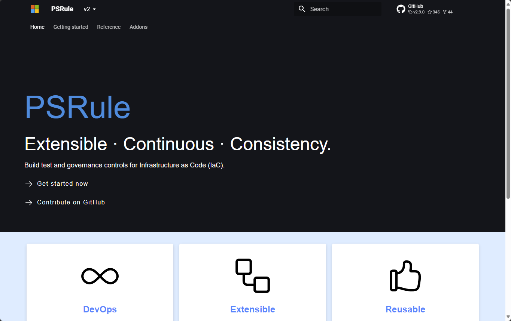

# Example Modules

Here are a handful of PowerShell modules with online documentation generated using
MkDocs. Check out their GitHub repos to see their `mkdocs.yml` configuration and
how they structure their markdown files.

## Posh-ACME

- :simple-github: [__Source on GitHub__](https://github.com/rmbolger/Posh-ACME)
- :octicons-globe-16: [__Website__](https://poshac.me/docs/v4/)

## PSAppDeployToolkit

- :simple-github: [__Source on GitHub__](https://github.com/PSAppDeployToolkit/PSAppDeployToolkit)
- :octicons-globe-16: [__Website__](https://psappdeploytoolkit.com/)

## PSHTML

- :simple-github: [__Source on GitHub__](https://github.com/Stephanevg/PSHTML)
- :octicons-globe-16: [__Website__](https://pshtml.readthedocs.io/en/latest/)

## PSRule

- :simple-github: [__Source on GitHub__](https://github.com/microsoft/PSRule)
- :octicons-globe-16: [__Website__](https://microsoft.github.io/PSRule/v2/)

## PowerVCF

- :simple-github: [__Source on GitHub__](https://github.com/vmware/powershell-module-for-vmware-cloud-foundation)
- :octicons-globe-16: [__Website__](https://pshtml.readthedocs.io/en/latest/)

